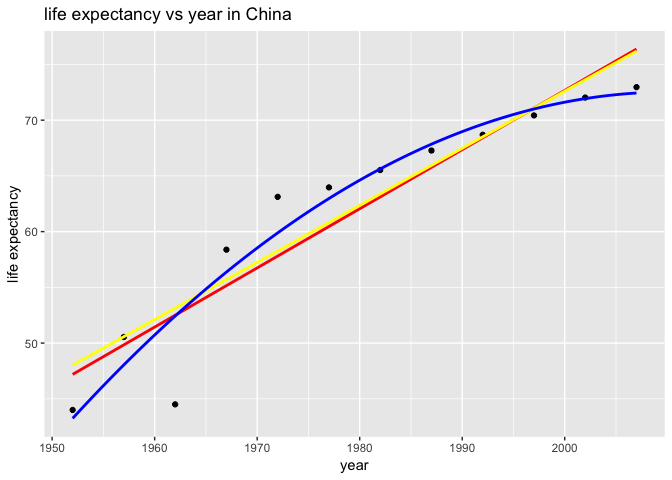

Homework6
================

In this assignment, I will use the following packages.

``` r
library(gapminder)
library(tidyverse)
```

    ## ── Attaching packages ───────────────────────────────────── tidyverse 1.2.1 ──

    ## ✔ ggplot2 3.0.0     ✔ purrr   0.2.5
    ## ✔ tibble  1.4.2     ✔ dplyr   0.7.6
    ## ✔ tidyr   0.8.1     ✔ stringr 1.3.1
    ## ✔ readr   1.1.1     ✔ forcats 0.3.0

    ## ── Conflicts ──────────────────────────────────────── tidyverse_conflicts() ──
    ## ✖ dplyr::filter() masks stats::filter()
    ## ✖ dplyr::lag()    masks stats::lag()

``` r
library(knitr)
library(MASS)
```

    ## 
    ## Attaching package: 'MASS'

    ## The following object is masked from 'package:dplyr':
    ## 
    ##     select

``` r
library(broom)
```

## Overview

In this homework, I will finish 3 tasks:

  - Character Data
  - Writing Function
  - Work with a nested data frame

## Character Data

### 14.2.5 Exercise

**3. Use str\_length() and str\_sub() to extract the middle character
from a string. What will you do if the string has an even number of
characters?**

``` r
x1<-"abcde" #x1 is oddd
str_sub(x1,(str_length(x1)+1)/2,(str_length(x1)+1)/2)
```

    ## [1] "c"

``` r
x2<-"abcdef" #x2 is even
str_sub(x2,str_length(x2)/2,str_length(x2)/2+1)
```

    ## [1] "cd"

**6.Write a function that turns (e.g.) a vector c(“a”, “b”, “c”) into
the string a, b, and c. Think carefully about what it should do if given
a vector of length 0, 1, or 2.**

``` r
vector_turns_string<-function(x){
   length <-length(x)
   if(length==0){
     stop("this is an empty vector")
   }
   if(length==1){
     return(x)
   }
   str1<-str_c(x[1:length-1],collapse=",")
   str2<-str_c(str1,x[length],sep=",and")
   return(str2)
}
x<-c("A","B","C")
vector_turns_string(x)
```

    ## [1] "A,B,andC"

### 14.3.1.1 Exercise

**3. What patterns will the regular expression ...... match? How would
you represent it as a string?**

The regular expression for this sequence is “\\..\\..\\..”.

``` r
x<-"\\..\\..\\.."
writeLines(x)
```

    ## \..\..\..

``` r
str_detect(x,"\\\\\\.\\.\\\\\\.\\.\\\\\\.\\.")
```

    ## [1] TRUE

### 14.3.2.1 Exercise

**2. Given the corpus of common words in stringr::words, create regular
expressions that find all words that:**

1.  Start with
    “y”.

<!-- end list -->

``` r
str_subset(words,"^y")
```

    ## [1] "year"      "yes"       "yesterday" "yet"       "you"       "young"

2.  End with “x”

<!-- end list -->

``` r
str_subset(words,"x$")
```

    ## [1] "box" "sex" "six" "tax"

3.  Are exactly three letters long. (Don’t cheat by using
    str\_length()\!)

<!-- end list -->

``` r
str_subset(words,"^...$")
```

    ##   [1] "act" "add" "age" "ago" "air" "all" "and" "any" "arm" "art" "ask"
    ##  [12] "bad" "bag" "bar" "bed" "bet" "big" "bit" "box" "boy" "bus" "but"
    ##  [23] "buy" "can" "car" "cat" "cup" "cut" "dad" "day" "die" "dog" "dry"
    ##  [34] "due" "eat" "egg" "end" "eye" "far" "few" "fit" "fly" "for" "fun"
    ##  [45] "gas" "get" "god" "guy" "hit" "hot" "how" "job" "key" "kid" "lad"
    ##  [56] "law" "lay" "leg" "let" "lie" "lot" "low" "man" "may" "mrs" "new"
    ##  [67] "non" "not" "now" "odd" "off" "old" "one" "out" "own" "pay" "per"
    ##  [78] "put" "red" "rid" "run" "say" "see" "set" "sex" "she" "sir" "sit"
    ##  [89] "six" "son" "sun" "tax" "tea" "ten" "the" "tie" "too" "top" "try"
    ## [100] "two" "use" "war" "way" "wee" "who" "why" "win" "yes" "yet" "you"

4.  Have seven letters or
    more.

<!-- end list -->

``` r
str_subset(words,"^.......") %>% head(20)
```

    ##  [1] "absolute"    "account"     "achieve"     "address"     "advertise"  
    ##  [6] "afternoon"   "against"     "already"     "alright"     "although"   
    ## [11] "america"     "another"     "apparent"    "appoint"     "approach"   
    ## [16] "appropriate" "arrange"     "associate"   "authority"   "available"

### 14.3.3.1 Exercise

**1. Create regular expressions to find all words that:**

1.  Start with a vowel.

<!-- end list -->

``` r
str_subset(words,"^[aeiou]")%>%head(20)
```

    ##  [1] "a"         "able"      "about"     "absolute"  "accept"   
    ##  [6] "account"   "achieve"   "across"    "act"       "active"   
    ## [11] "actual"    "add"       "address"   "admit"     "advertise"
    ## [16] "affect"    "afford"    "after"     "afternoon" "again"

2.  That only contain consonants. (Hint: thinking about matching
    “not”-vowels.)

<!-- end list -->

``` r
str_subset(words,"^[^aeiou]+$")
```

    ## [1] "by"  "dry" "fly" "mrs" "try" "why"

3.  End with ed, but not with eed.

<!-- end list -->

``` r
str_subset(words,"[^e]ed$")
```

    ## [1] "bed"     "hundred" "red"

4.  End with ing or ise.

<!-- end list -->

``` r
str_subset(words,"ing$|ise$")
```

    ##  [1] "advertise" "bring"     "during"    "evening"   "exercise" 
    ##  [6] "king"      "meaning"   "morning"   "otherwise" "practise" 
    ## [11] "raise"     "realise"   "ring"      "rise"      "sing"     
    ## [16] "surprise"  "thing"

**5. Create a regular expression that will match telephone numbers as
commonly written in your country.**

``` r
x<-c("7789347784","774978230")
str_detect(x,"\\d\\d\\d\\d\\d\\d\\d\\d\\d\\d")
```

    ## [1]  TRUE FALSE

### 14.3.4.1 Exercise

**3. Create regular expressions to find all words that:**

1.  Start with three consonants.

<!-- end list -->

``` r
str_subset(words,"^[^aeiou]{3}")
```

    ##  [1] "Christ"    "Christmas" "dry"       "fly"       "mrs"      
    ##  [6] "scheme"    "school"    "straight"  "strategy"  "street"   
    ## [11] "strike"    "strong"    "structure" "system"    "three"    
    ## [16] "through"   "throw"     "try"       "type"      "why"

2.  Have three or more vowels in a
    row.

<!-- end list -->

``` r
str_subset(words,"[aeiou]{3,}")
```

    ## [1] "beauty"   "obvious"  "previous" "quiet"    "serious"  "various"

3.  Have two or more vowel-consonant pairs in a row.

<!-- end list -->

``` r
str_subset(words,"([aeiou][^aeiou]){2,}")%>%head(20)
```

    ##  [1] "absolute"  "agent"     "along"     "america"   "another"  
    ##  [6] "apart"     "apparent"  "authority" "available" "aware"    
    ## [11] "away"      "balance"   "basis"     "become"    "before"   
    ## [16] "begin"     "behind"    "benefit"   "business"  "character"

### 14.4.2 Exercise

**1. For each of the following challenges, try solving it by using both
a single regular expression, and a combination of multiple str\_detect()
calls.**

1.  Find all words that start or end with x.

Regular Expression

``` r
str_subset(words,"(^x)|(x$)")
```

    ## [1] "box" "sex" "six" "tax"

Using `str_detect()`

``` r
s1<-str_detect(words, "^x")
s2<-str_detect(words,"x$")
s3<-words[s1|s2]
s3
```

    ## [1] "box" "sex" "six" "tax"

2.  Find all words that start with a vowel and end with a consonant.

Regular
    Expression

``` r
str_subset(words,"^[aeiou].*[^aeiou]$")%>%head(10)
```

    ##  [1] "about"   "accept"  "account" "across"  "act"     "actual"  "add"    
    ##  [8] "address" "admit"   "affect"

Using `str_detect()`

``` r
s1<-str_detect(words, "^[aeiou]")
s2<-str_detect(words,"[^aeiou]$")
s3<-words[s1&s2]
head(s3,10)
```

    ##  [1] "about"   "accept"  "account" "across"  "act"     "actual"  "add"    
    ##  [8] "address" "admit"   "affect"

**2. What word has the highest number of vowels? What word has the
highest proportion of vowels? (Hint: what is the denominator?)**

Highest number of
    vowels

``` r
str_count(words,"[aeiou]")%>%max()
```

    ## [1] 5

``` r
words[str_count(words,"[aeiou]")==5]
```

    ## [1] "appropriate" "associate"   "available"   "colleague"   "encourage"  
    ## [6] "experience"  "individual"  "television"

Highest proportion of vowels

``` r
a<-str_count(words,"[aeiou]")
b<-str_count(words,".")
max(a/b)
```

    ## [1] 1

``` r
words[a/b==max(a/b)]
```

    ## [1] "a"

### 14.4.3.1 Exercise

**2. From the Harvard sentences data, extract:**

1.  The first word from each sentence.

<!-- end list -->

``` r
noun<-"^[^ ]+"
str_extract(sentences,noun)%>%head(10)
```

    ##  [1] "The"   "Glue"  "It's"  "These" "Rice"  "The"   "The"   "The"  
    ##  [9] "Four"  "Large"

2.  All words ending in ing.

<!-- end list -->

``` r
noun<-"([^ ]+)ing"
s1<-str_subset(sentences,noun)
str_extract(s1,noun)%>%unique
```

    ##  [1] "stocking"  "spring"    "evening"   "morning"   "winding"  
    ##  [6] "living"    "king"      "Adding"    "making"    "raging"   
    ## [11] "playing"   "sleeping"  "ring"      "glaring"   "sinking"  
    ## [16] "thing"     "dying"     "Bring"     "lodging"   "filing"   
    ## [21] "wearing"   "wading"    "swing"     "nothing"   "Whiting"  
    ## [26] "sing"      "bring"     "painting"  "walking"   "ling"     
    ## [31] "shipping"  "hing"      "puzzling"  "landing"   "waiting"  
    ## [36] "whistling" "timing"    "ting"      "changing"  "drenching"
    ## [41] "moving"    "working"

### 14.4.5.1 Exercise

**1. Replace all forward slashes in a string with backslashes.**

``` r
str_replace_all("A/B","/","\\\\")%>%writeLines()
```

    ## A\B

**2. Implement a simple version of str\_to\_lower() using
replace\_all().**

``` r
str_replace_all(sentences,".",tolower)%>%head(10)
```

    ##  [1] "the birch canoe slid on the smooth planks." 
    ##  [2] "glue the sheet to the dark blue background."
    ##  [3] "it's easy to tell the depth of a well."     
    ##  [4] "these days a chicken leg is a rare dish."   
    ##  [5] "rice is often served in round bowls."       
    ##  [6] "the juice of lemons makes fine punch."      
    ##  [7] "the box was thrown beside the parked truck."
    ##  [8] "the hogs were fed chopped corn and garbage."
    ##  [9] "four hours of steady work faced us."        
    ## [10] "large size in stockings is hard to sell."

### 14.4.6.1 Exercise

**1. Split up a string like “apples, pears, and bananas” into individual
components.**

``` r
fruit<-"apples, pears, and bananas"
str_split(fruit,boundary("word"))
```

    ## [[1]]
    ## [1] "apples"  "pears"   "and"     "bananas"

**2. Why is it better to split up by boundary(“word”) than " "?**

``` r
s<-"book: A, B, and C"
str_split(s,boundary("word"))
```

    ## [[1]]
    ## [1] "book" "A"    "B"    "and"  "C"

``` r
str_split(s," ")
```

    ## [[1]]
    ## [1] "book:" "A,"    "B,"    "and"   "C"

Obviously, using boundary(“word”) can avoid punctuation marks but " "
cannot.

### 14.5.1 Exercise

**2. What are the five most common words in sentences?**

``` r
w<-str_split(sentences,boundary("word"))%>%
  unlist()%>%
  str_to_lower()
enframe(w)%>%
  group_by(value)%>%
  count()%>%
  arrange(desc(n))%>%
  head(5)
```

    ## # A tibble: 5 x 2
    ## # Groups:   value [5]
    ##   value     n
    ##   <chr> <int>
    ## 1 the     751
    ## 2 a       202
    ## 3 of      132
    ## 4 to      123
    ## 5 and     118

## Writing Functions

I plan to work on a mini-data dataframe of China.

``` r
selected_country <- "China"
data<-gapminder%>%
  filter(country==selected_country)
kable(data)
```

| country | continent | year |  lifeExp |        pop | gdpPercap |
| :------ | :-------- | ---: | -------: | ---------: | --------: |
| China   | Asia      | 1952 | 44.00000 |  556263527 |  400.4486 |
| China   | Asia      | 1957 | 50.54896 |  637408000 |  575.9870 |
| China   | Asia      | 1962 | 44.50136 |  665770000 |  487.6740 |
| China   | Asia      | 1967 | 58.38112 |  754550000 |  612.7057 |
| China   | Asia      | 1972 | 63.11888 |  862030000 |  676.9001 |
| China   | Asia      | 1977 | 63.96736 |  943455000 |  741.2375 |
| China   | Asia      | 1982 | 65.52500 | 1000281000 |  962.4214 |
| China   | Asia      | 1987 | 67.27400 | 1084035000 | 1378.9040 |
| China   | Asia      | 1992 | 68.69000 | 1164970000 | 1655.7842 |
| China   | Asia      | 1997 | 70.42600 | 1230075000 | 2289.2341 |
| China   | Asia      | 2002 | 72.02800 | 1280400000 | 3119.2809 |
| China   | Asia      | 2007 | 72.96100 | 1318683096 | 4959.1149 |

Let’s apply linear regression, quadratic regression and robust
regression on China.

``` r
ggplot(data,aes(x=year,y=lifeExp))+
  geom_point()+
  geom_smooth(method = "lm", color = "red", se = FALSE)+
  geom_smooth(method = "rlm", color = "yellow", se = FALSE)+
  geom_smooth(method = "lm", formula = y~x+I(x^2), color = "blue", se = FALSE)+
  labs(x = "year",
       y = "life expectancy",
       title = "life expectancy vs year in China")
```

<!-- -->

Next, I will split the data into training set (half of data) and test
set (other half of data). Then I will use Mean Absolute Prediction Error
and Mean Squared Prediction Error as performance measure.

Now I will the data into two sets.

``` r
n <- nrow(data)
index <- sample(n,n/2)
(data_test <- data[index,])
```

    ## # A tibble: 6 x 6
    ##   country continent  year lifeExp        pop gdpPercap
    ##   <fct>   <fct>     <int>   <dbl>      <int>     <dbl>
    ## 1 China   Asia       2002    72.0 1280400000     3119.
    ## 2 China   Asia       1977    64.0  943455000      741.
    ## 3 China   Asia       1962    44.5  665770000      488.
    ## 4 China   Asia       1997    70.4 1230075000     2289.
    ## 5 China   Asia       1992    68.7 1164970000     1656.
    ## 6 China   Asia       1972    63.1  862030000      677.

``` r
(data_training <- data[-index,])
```

    ## # A tibble: 6 x 6
    ##   country continent  year lifeExp        pop gdpPercap
    ##   <fct>   <fct>     <int>   <dbl>      <int>     <dbl>
    ## 1 China   Asia       1952    44    556263527      400.
    ## 2 China   Asia       1957    50.5  637408000      576.
    ## 3 China   Asia       1967    58.4  754550000      613.
    ## 4 China   Asia       1982    65.5 1000281000      962.
    ## 5 China   Asia       1987    67.3 1084035000     1379.
    ## 6 China   Asia       2007    73.0 1318683096     4959.

Then I will fit a linear model to the training set and then compute mspe
and mape on the test set.

``` r
linear_model<-function(training,test,offset = 1952){
  #fit linear model to training set
  training$year = training$year-offset
  linear_fit<-lm(lifeExp~year, training)
  #predict lifeExp based on linear model 
  test$year = test$year-offset
  predict_value<-predict(linear_fit,test)  
  #compute mspe and mape on the test set
  mspe<-with(test,mean((test$lifeExp-predict_value)^2))
  mape<-with(test,mean(abs(test$lifeExp-predict_value)))
  intercept = coef(linear_fit)[1]
  slope = coef(linear_fit)[2]
  return(c(intercept,slope,"mspe" = mspe,"mape" = mape))
}
linear_model(data_training,data_test)
```

    ## (Intercept)        year        mspe        mape 
    ##  47.8355084   0.5119788  18.3889768   3.1767426

Next I will fit a quadratic model to the training set and then compute
mspe and mape on the test set.

``` r
quadratic_model<-function(training,test,offset = 1952){
  #fit quadratic model to training set
  training$year = training$year-offset
  quadratic_fit<-lm(lifeExp~I(year)+I(year^2), training)
  #predict lifeExp based on quadratic model 
  test$year = test$year-offset
  predict_value<-predict(quadratic_fit,test)  
  #compute mspe and mape on the test set
  mspe<-with(test,mean((test$lifeExp-predict_value)^2))
  mape<-with(test,mean(abs(test$lifeExp-predict_value)))
  intercept = coef(quadratic_fit)[1]
  slope1 = coef(quadratic_fit)[2]
  slope2 = coef(quadratic_fit)[3]
  return(c(intercept,slope1,slope2,"mspe" = mspe,"mape" = mape))
}
quadratic_model(data_training,data_test)
```

    ##  (Intercept)      I(year)    I(year^2)         mspe         mape 
    ## 45.158269622  0.926783660 -0.007779491 15.335396412  2.330405543

Finally, I will fit a robust model to the training set and then compute
mspe and mape on the test set.

``` r
robust_model<-function(training,test,offset = 1952){
  #fit robust model to training set
  training$year = training$year-offset
  robust_fit<-rlm(lifeExp~year, training)
  #predict lifeExp based on robust model 
  test$year = test$year-offset
  predict_value<-predict(robust_fit,test)  
  #compute mspe and mape on the test set
  mspe<-with(test,mean((test$lifeExp-predict_value)^2))
  mape<-with(test,mean(abs(test$lifeExp-predict_value)))
  intercept = coef(robust_fit)[1]
  slope = coef(robust_fit)[2]
  return(c(intercept,slope,"mspe" = mspe,"mape" = mape))
}
robust_model(data_training,data_test)
```

    ## (Intercept)        year        mspe        mape 
    ##  47.8355084   0.5119788  18.3889768   3.1767426

We can find that quadratic regression has smallest mspe and mape. Linear
regression and robust regression have similar intercept, slope, mspe and
mape(sometimes the same results).

## Work with a nested data frame

**Nest the data by country and continent**

``` r
(nest<-group_by(gapminder,continent,country)%>%
  nest())
```

    ## # A tibble: 142 x 3
    ##    continent country     data             
    ##    <fct>     <fct>       <list>           
    ##  1 Asia      Afghanistan <tibble [12 × 4]>
    ##  2 Europe    Albania     <tibble [12 × 4]>
    ##  3 Africa    Algeria     <tibble [12 × 4]>
    ##  4 Africa    Angola      <tibble [12 × 4]>
    ##  5 Americas  Argentina   <tibble [12 × 4]>
    ##  6 Oceania   Australia   <tibble [12 × 4]>
    ##  7 Europe    Austria     <tibble [12 × 4]>
    ##  8 Asia      Bahrain     <tibble [12 × 4]>
    ##  9 Asia      Bangladesh  <tibble [12 × 4]>
    ## 10 Europe    Belgium     <tibble [12 × 4]>
    ## # ... with 132 more rows

**Robust model of life expectancy against year**

``` r
robust<-function(data){
  rlm(lifeExp~I(year-1952),data)
}
```

**Fit robust model of life expectancy against year**

``` r
(nest<-nest%>%
  mutate(robust_fit = map(data,robust)))
```

    ## Warning in rlm.default(x, y, weights, method = method, wt.method =
    ## wt.method, : 'rlm' failed to converge in 20 steps
    
    ## Warning in rlm.default(x, y, weights, method = method, wt.method =
    ## wt.method, : 'rlm' failed to converge in 20 steps
    
    ## Warning in rlm.default(x, y, weights, method = method, wt.method =
    ## wt.method, : 'rlm' failed to converge in 20 steps

    ## # A tibble: 142 x 4
    ##    continent country     data              robust_fit
    ##    <fct>     <fct>       <list>            <list>    
    ##  1 Asia      Afghanistan <tibble [12 × 4]> <S3: rlm> 
    ##  2 Europe    Albania     <tibble [12 × 4]> <S3: rlm> 
    ##  3 Africa    Algeria     <tibble [12 × 4]> <S3: rlm> 
    ##  4 Africa    Angola      <tibble [12 × 4]> <S3: rlm> 
    ##  5 Americas  Argentina   <tibble [12 × 4]> <S3: rlm> 
    ##  6 Oceania   Australia   <tibble [12 × 4]> <S3: rlm> 
    ##  7 Europe    Austria     <tibble [12 × 4]> <S3: rlm> 
    ##  8 Asia      Bahrain     <tibble [12 × 4]> <S3: rlm> 
    ##  9 Asia      Bangladesh  <tibble [12 × 4]> <S3: rlm> 
    ## 10 Europe    Belgium     <tibble [12 × 4]> <S3: rlm> 
    ## # ... with 132 more rows

**Apply `tidy()` to the model for each country**

``` r
(nest<-nest%>%
  mutate(tidy = map(robust_fit,tidy)))
```

    ## # A tibble: 142 x 5
    ##    continent country     data              robust_fit tidy            
    ##    <fct>     <fct>       <list>            <list>     <list>          
    ##  1 Asia      Afghanistan <tibble [12 × 4]> <S3: rlm>  <tibble [2 × 4]>
    ##  2 Europe    Albania     <tibble [12 × 4]> <S3: rlm>  <tibble [2 × 4]>
    ##  3 Africa    Algeria     <tibble [12 × 4]> <S3: rlm>  <tibble [2 × 4]>
    ##  4 Africa    Angola      <tibble [12 × 4]> <S3: rlm>  <tibble [2 × 4]>
    ##  5 Americas  Argentina   <tibble [12 × 4]> <S3: rlm>  <tibble [2 × 4]>
    ##  6 Oceania   Australia   <tibble [12 × 4]> <S3: rlm>  <tibble [2 × 4]>
    ##  7 Europe    Austria     <tibble [12 × 4]> <S3: rlm>  <tibble [2 × 4]>
    ##  8 Asia      Bahrain     <tibble [12 × 4]> <S3: rlm>  <tibble [2 × 4]>
    ##  9 Asia      Bangladesh  <tibble [12 × 4]> <S3: rlm>  <tibble [2 × 4]>
    ## 10 Europe    Belgium     <tibble [12 × 4]> <S3: rlm>  <tibble [2 × 4]>
    ## # ... with 132 more rows

**Use unnest() function to display the tidy information corresponding to
each country**

``` r
(unnest<-nest%>%
  dplyr::select(continent,country,tidy)%>%
  unnest(tidy))
```

    ## # A tibble: 284 x 6
    ##    continent country     term           estimate std.error statistic
    ##    <fct>     <fct>       <chr>             <dbl>     <dbl>     <dbl>
    ##  1 Asia      Afghanistan (Intercept)      29.9     0.664       45.0 
    ##  2 Asia      Afghanistan I(year - 1952)    0.275   0.0205      13.5 
    ##  3 Europe    Albania     (Intercept)      59.9     0.935       64.1 
    ##  4 Europe    Albania     I(year - 1952)    0.316   0.0288      11.0 
    ##  5 Africa    Algeria     (Intercept)      43.2     0.601       71.8 
    ##  6 Africa    Algeria     I(year - 1952)    0.576   0.0185      31.1 
    ##  7 Africa    Angola      (Intercept)      32.1     0.941       34.2 
    ##  8 Africa    Angola      I(year - 1952)    0.209   0.0290       7.21
    ##  9 Americas  Argentina   (Intercept)      62.7     0.143      438.  
    ## 10 Americas  Argentina   I(year - 1952)    0.233   0.00440     52.9 
    ## # ... with 274 more rows

``` r
#set names "intercept" and "slope"
(unnest<-unnest%>%
  mutate(term = recode(term,
                       "(Intercept)" = "intercept_robust",
                       "I(year - 1952)" = "slope_robust")))
```

    ## # A tibble: 284 x 6
    ##    continent country     term             estimate std.error statistic
    ##    <fct>     <fct>       <chr>               <dbl>     <dbl>     <dbl>
    ##  1 Asia      Afghanistan intercept_robust   29.9     0.664       45.0 
    ##  2 Asia      Afghanistan slope_robust        0.275   0.0205      13.5 
    ##  3 Europe    Albania     intercept_robust   59.9     0.935       64.1 
    ##  4 Europe    Albania     slope_robust        0.316   0.0288      11.0 
    ##  5 Africa    Algeria     intercept_robust   43.2     0.601       71.8 
    ##  6 Africa    Algeria     slope_robust        0.576   0.0185      31.1 
    ##  7 Africa    Angola      intercept_robust   32.1     0.941       34.2 
    ##  8 Africa    Angola      slope_robust        0.209   0.0290       7.21
    ##  9 Americas  Argentina   intercept_robust   62.7     0.143      438.  
    ## 10 Americas  Argentina   slope_robust        0.233   0.00440     52.9 
    ## # ... with 274 more rows

``` r
#using spread() function to reshape unnest
(unnest<-unnest%>%
  dplyr::select(continent:estimate)%>%
  spread(key = term,value = estimate))
```

    ## # A tibble: 142 x 4
    ##    continent country                  intercept_robust slope_robust
    ##    <fct>     <fct>                               <dbl>        <dbl>
    ##  1 Africa    Algeria                              43.2       0.576 
    ##  2 Africa    Angola                               32.1       0.209 
    ##  3 Africa    Benin                                39.6       0.334 
    ##  4 Africa    Botswana                             52.9       0.0607
    ##  5 Africa    Burkina Faso                         34.7       0.364 
    ##  6 Africa    Burundi                              40.6       0.154 
    ##  7 Africa    Cameroon                             41.2       0.250 
    ##  8 Africa    Central African Republic             38.8       0.184 
    ##  9 Africa    Chad                                 39.8       0.255 
    ## 10 Africa    Comoros                              40.0       0.451 
    ## # ... with 132 more rows

**Fit a linear model of life expectancy against year**

``` r
linear<-function(data){
  lm(lifeExp~I(year-1952),data)
}
(nest2<-group_by(gapminder,continent,country)%>%
  nest())
```

    ## # A tibble: 142 x 3
    ##    continent country     data             
    ##    <fct>     <fct>       <list>           
    ##  1 Asia      Afghanistan <tibble [12 × 4]>
    ##  2 Europe    Albania     <tibble [12 × 4]>
    ##  3 Africa    Algeria     <tibble [12 × 4]>
    ##  4 Africa    Angola      <tibble [12 × 4]>
    ##  5 Americas  Argentina   <tibble [12 × 4]>
    ##  6 Oceania   Australia   <tibble [12 × 4]>
    ##  7 Europe    Austria     <tibble [12 × 4]>
    ##  8 Asia      Bahrain     <tibble [12 × 4]>
    ##  9 Asia      Bangladesh  <tibble [12 × 4]>
    ## 10 Europe    Belgium     <tibble [12 × 4]>
    ## # ... with 132 more rows

``` r
(nest2<-nest2%>%
  mutate(linear_fit = map(data,linear)))
```

    ## # A tibble: 142 x 4
    ##    continent country     data              linear_fit
    ##    <fct>     <fct>       <list>            <list>    
    ##  1 Asia      Afghanistan <tibble [12 × 4]> <S3: lm>  
    ##  2 Europe    Albania     <tibble [12 × 4]> <S3: lm>  
    ##  3 Africa    Algeria     <tibble [12 × 4]> <S3: lm>  
    ##  4 Africa    Angola      <tibble [12 × 4]> <S3: lm>  
    ##  5 Americas  Argentina   <tibble [12 × 4]> <S3: lm>  
    ##  6 Oceania   Australia   <tibble [12 × 4]> <S3: lm>  
    ##  7 Europe    Austria     <tibble [12 × 4]> <S3: lm>  
    ##  8 Asia      Bahrain     <tibble [12 × 4]> <S3: lm>  
    ##  9 Asia      Bangladesh  <tibble [12 × 4]> <S3: lm>  
    ## 10 Europe    Belgium     <tibble [12 × 4]> <S3: lm>  
    ## # ... with 132 more rows

``` r
(nest2<-nest2%>%
  mutate(tidy = map(linear_fit,tidy)))
```

    ## # A tibble: 142 x 5
    ##    continent country     data              linear_fit tidy            
    ##    <fct>     <fct>       <list>            <list>     <list>          
    ##  1 Asia      Afghanistan <tibble [12 × 4]> <S3: lm>   <tibble [2 × 5]>
    ##  2 Europe    Albania     <tibble [12 × 4]> <S3: lm>   <tibble [2 × 5]>
    ##  3 Africa    Algeria     <tibble [12 × 4]> <S3: lm>   <tibble [2 × 5]>
    ##  4 Africa    Angola      <tibble [12 × 4]> <S3: lm>   <tibble [2 × 5]>
    ##  5 Americas  Argentina   <tibble [12 × 4]> <S3: lm>   <tibble [2 × 5]>
    ##  6 Oceania   Australia   <tibble [12 × 4]> <S3: lm>   <tibble [2 × 5]>
    ##  7 Europe    Austria     <tibble [12 × 4]> <S3: lm>   <tibble [2 × 5]>
    ##  8 Asia      Bahrain     <tibble [12 × 4]> <S3: lm>   <tibble [2 × 5]>
    ##  9 Asia      Bangladesh  <tibble [12 × 4]> <S3: lm>   <tibble [2 × 5]>
    ## 10 Europe    Belgium     <tibble [12 × 4]> <S3: lm>   <tibble [2 × 5]>
    ## # ... with 132 more rows

``` r
(unnest2<-nest2%>%
  dplyr::select(continent,country,tidy)%>%
  unnest(tidy))
```

    ## # A tibble: 284 x 7
    ##    continent country     term        estimate std.error statistic  p.value
    ##    <fct>     <fct>       <chr>          <dbl>     <dbl>     <dbl>    <dbl>
    ##  1 Asia      Afghanistan (Intercept)   29.9     0.664       45.0  7.00e-13
    ##  2 Asia      Afghanistan I(year - 1…    0.275   0.0205      13.5  9.84e- 8
    ##  3 Europe    Albania     (Intercept)   59.2     1.08        55.0  9.57e-14
    ##  4 Europe    Albania     I(year - 1…    0.335   0.0332      10.1  1.46e- 6
    ##  5 Africa    Algeria     (Intercept)   43.4     0.718       60.4  3.78e-14
    ##  6 Africa    Algeria     I(year - 1…    0.569   0.0221      25.7  1.81e-10
    ##  7 Africa    Angola      (Intercept)   32.1     0.764       42.0  1.39e-12
    ##  8 Africa    Angola      I(year - 1…    0.209   0.0235       8.90 4.59e- 6
    ##  9 Americas  Argentina   (Intercept)   62.7     0.159      395.   2.66e-22
    ## 10 Americas  Argentina   I(year - 1…    0.232   0.00489     47.4  4.22e-13
    ## # ... with 274 more rows

``` r
(unnest2<-unnest2%>%
  mutate(term = recode(term,
                       "(Intercept)" = "intercept_linear",
                       "I(year - 1952)" = "slope_linear")))
```

    ## # A tibble: 284 x 7
    ##    continent country    term         estimate std.error statistic  p.value
    ##    <fct>     <fct>      <chr>           <dbl>     <dbl>     <dbl>    <dbl>
    ##  1 Asia      Afghanist… intercept_l…   29.9     0.664       45.0  7.00e-13
    ##  2 Asia      Afghanist… slope_linear    0.275   0.0205      13.5  9.84e- 8
    ##  3 Europe    Albania    intercept_l…   59.2     1.08        55.0  9.57e-14
    ##  4 Europe    Albania    slope_linear    0.335   0.0332      10.1  1.46e- 6
    ##  5 Africa    Algeria    intercept_l…   43.4     0.718       60.4  3.78e-14
    ##  6 Africa    Algeria    slope_linear    0.569   0.0221      25.7  1.81e-10
    ##  7 Africa    Angola     intercept_l…   32.1     0.764       42.0  1.39e-12
    ##  8 Africa    Angola     slope_linear    0.209   0.0235       8.90 4.59e- 6
    ##  9 Americas  Argentina  intercept_l…   62.7     0.159      395.   2.66e-22
    ## 10 Americas  Argentina  slope_linear    0.232   0.00489     47.4  4.22e-13
    ## # ... with 274 more rows

``` r
(unnest2<-unnest2%>%
  dplyr::select(continent:estimate)%>%
  spread(key = term,value = estimate))
```

    ## # A tibble: 142 x 4
    ##    continent country                  intercept_linear slope_linear
    ##    <fct>     <fct>                               <dbl>        <dbl>
    ##  1 Africa    Algeria                              43.4       0.569 
    ##  2 Africa    Angola                               32.1       0.209 
    ##  3 Africa    Benin                                39.6       0.334 
    ##  4 Africa    Botswana                             52.9       0.0607
    ##  5 Africa    Burkina Faso                         34.7       0.364 
    ##  6 Africa    Burundi                              40.6       0.154 
    ##  7 Africa    Cameroon                             41.2       0.250 
    ##  8 Africa    Central African Republic             38.8       0.184 
    ##  9 Africa    Chad                                 39.8       0.253 
    ## 10 Africa    Comoros                              40.0       0.450 
    ## # ... with 132 more rows

**Join linear model and linear model**

``` r
new_data<-full_join(unnest,unnest2,by=c("continent","country"))
head(new_data,5)%>%kable()
```

| continent | country      | intercept\_robust | slope\_robust | intercept\_linear | slope\_linear |
| :-------- | :----------- | ----------------: | ------------: | ----------------: | ------------: |
| Africa    | Algeria      |          43.15800 |     0.5758313 |          43.37497 |     0.5692797 |
| Africa    | Angola       |          32.13493 |     0.2090313 |          32.12665 |     0.2093399 |
| Africa    | Benin        |          39.58851 |     0.3342329 |          39.58851 |     0.3342329 |
| Africa    | Botswana     |          52.92912 |     0.0606685 |          52.92912 |     0.0606685 |
| Africa    | Burkina Faso |          34.68469 |     0.3639748 |          34.68469 |     0.3639748 |

**Find interesting countries in terms large slope difference betweeen
two models**

``` r
new_data<-new_data%>%
  mutate(difference=slope_robust-slope_linear)%>%
  filter(difference > mean(difference)+2*sd(difference) | difference < mean(difference)-2*sd(difference))
kable(new_data)
```

| continent | country      | intercept\_robust | slope\_robust | intercept\_linear | slope\_linear |  difference |
| :-------- | :----------- | ----------------: | ------------: | ----------------: | ------------: | ----------: |
| Africa    | Lesotho      |          45.73783 |     0.1966774 |          47.37903 |     0.0955657 |   0.1011116 |
| Africa    | Rwanda       |          42.31571 |     0.0323785 |          42.74195 |   \-0.0458315 |   0.0782100 |
| Africa    | South Africa |          47.53848 |     0.2807921 |          49.34128 |     0.1691594 |   0.1116327 |
| Africa    | Swaziland    |          44.55009 |     0.2101672 |          46.38786 |     0.0950748 |   0.1150924 |
| Europe    | Bulgaria     |          67.57414 |     0.0977715 |          65.73731 |     0.1456888 | \-0.0479174 |

This table shows interesting countries which have large slope difference
between linear model and robust model.
